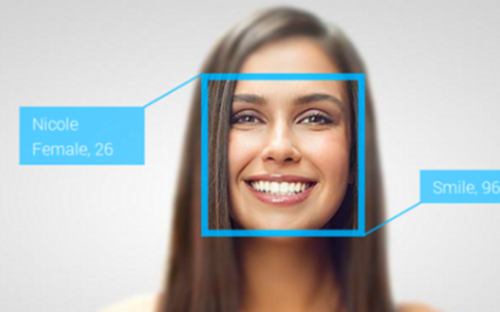
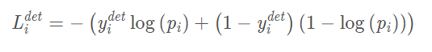
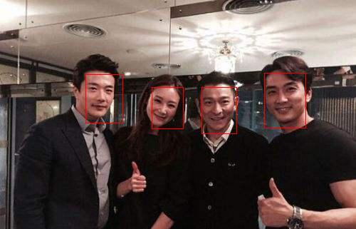
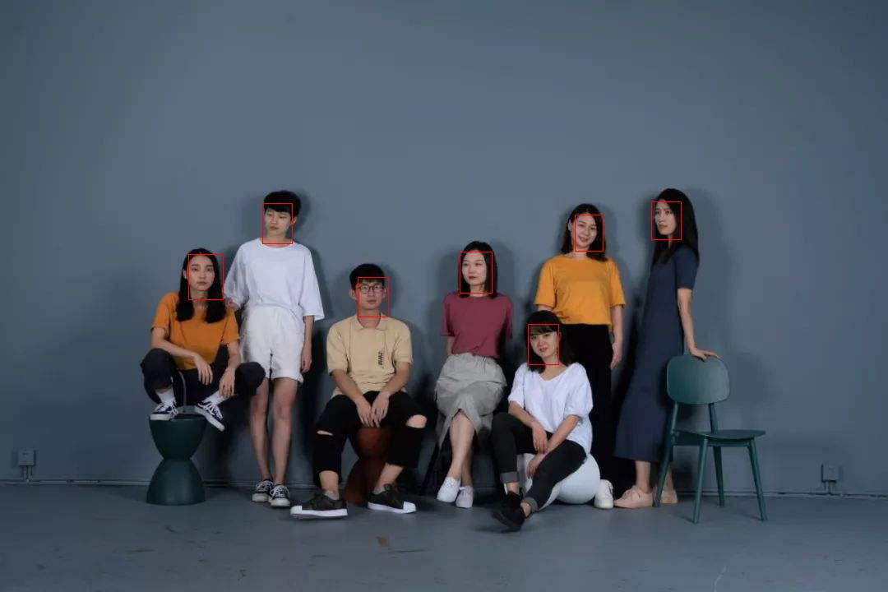
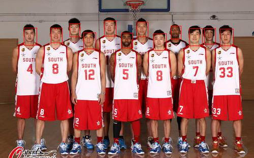
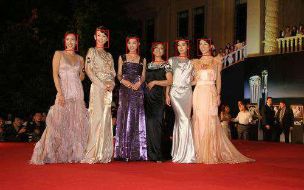

<p align="center">
  <a href=""></a>
</p>


<span align="center">

#### :smiling_imp: one_project_of_mtcnn

[](https://circleci.com/gh/google/pybadges)


[](https://doi-janky.infosiftr.net/job/multiarch/job/arm64v8/job/python/)
[](https://github.com/homebridge/homebridge/wiki/Verified-Plugins)

</span>
:herb: mtcnn侦测网络对小目标的精准检测是有目共睹，并且在速度上也可以说是符合了商业
化的运用。学完mtcnn的原理之后，于是心血来潮，便自己实现了一个。有关于重点代码
的标注解释，在代码里均有详细的介绍，这样做的目的是为了方便阅读学习，今后修改起
代码也有所依据。  

:four_leaf_clover: 如果本项目对你们有所帮助或启发的话，麻烦点个星，谢谢~

:maple_leaf: 后续会有陆续更新，包括这篇说明文档~
## 基本设计思想：
   * 级联思想  
      采用多重步骤，将复杂任务逐步分解，达到省时省力的效果。在mtcnn中的体现是，将大量的框分别经过三个大小，
      深度不一样的网络，将输出框由”粗略筛选“的模式直到”精细筛选“，这一最直接的体现便是P到O网络层次的逐步加深，
      但越往后框就越少。
   * 框的设计  
      为了保证更加精确的检测到大小不一的人脸，mtcnn采用了”框不动，图像动“的相对大小缩放原理，
      而该原理的实现技术为图像金字塔（本项目采用的缩放比例为：0.7）。
   * 整体卷积核及步长  
      在卷积的设计中，由于较大的核会给计算机带来更大的计算量，故而有种将大核分解成多个小核的方法
      可以有效的解决计算量的问题，并且能够加深网络，增加网络的抽象特征的提取能力。以mtcnn的P网络
      为例，在除了做分类外的FCN层，其他三个卷积加上最大池化，一共四个3*3的核，就相当于12*12核的
      卷积，并且适当设置了步长为2的最大池化，此举可适当增大这一层提取到的特征图的大小，保留更多的
      特征信息。  
      ```
      self.pre_layer = nn.Sequential(
            nn.Conv2d(in_channels=3, out_channels=10, kernel_size=3, stride=1, padding=1),
            nn.PReLU(),
            nn.MaxPool2d(kernel_size=3, stride=2),
            nn.Conv2d(in_channels=10, out_channels=16, kernel_size=3, stride=1),
            nn.PReLU(),
            nn.Conv2d(16, 32, 3, 1),
            nn.PReLU()
        )
      ```
   * 特征图信息表达  
     在P网络的设计中，去除了限制图片输入大小的全连接层，取而代之的则是全卷积。因此，P网络输出的结果
     为特征图信息结构。在该结构中，mtcnn的作者将输出的特征图上的每个像素点，分别来代替置信度，坐标
     的偏移量，关键点偏移量等。
   * 特征图反算  
     特征图的索引计算按照（w, h）  
     计算方法为，原图左上角的坐标等于特征图的索引乘以步长，右下角的坐标等于特征图的索引乘以步长加卷积
     核的大小。
## 损失函数：
   * 置信度损失（交叉熵）：  
      <p align="left">
  <a href=""></a>
      </p>
   * 回归框的损失：  
      <p align="left">
  <a href=""></a>
      </p>
## 关键技术点：
   * FCN  
      在P网络采用全卷积(FCN)的设计是因为，P网络接收的是不固定大小的数据；此处的每个像素点，
      都代表一个类别的预测，同时保留了原图像的空间信息。
   * IOU  
      IOU分两种：一种是以两者的交集为分母；一种是以两者间较小面积的框值为分母
   * MNS  
      非极大值抑制，抑制不是极大值的元素。可以使用该方法去掉重合度较高且IOU值较小的框
   * Image Pyramid  
      图像金字塔，由于mtcnn的设计思想是将输出结果的框固定了尺寸大小，所以为了确保能够框住
      所有不同大小的目标体，将图片按一定的比例去缩小（图片的缩小相当于框的扩大），重复检测（原图检测）。
   * PReLu  
      在MTCNN中，卷积网络采用的激活函数是PRelu，带有参数的带有参数的Relu，相对于Relu滤除负值的做法，
      PRule对负值进行了添加参数而不是直接滤除，这种做法会给算法带来更多的计算量和更多的过拟合的可能性，
      但是由于保留了更多的信息，也可能是训练结果拟合性能更好。
## 三个网络：
   * #### P,R,O 三网络:  
     * P网络（Proposal Network）  
     采用FCN进行对特征的初步提取与标定边框，框出可能存在人脸的区域（置信度），利用图像金字塔与NMS对重复的框进行初步
     的筛选。将初步筛选（筛选出来的框任较多）的框传入下一个网络，R网络，做第二次筛选。
     * R网络（Refine Network）  
     相对于P网络而言，增加了一个全连接层，因此网络对于数据的筛选会更加严格。此时R网络会筛选掉P网络中效果比较差的候选框
     ，输出较可信的人脸区域，供O网络使用。由于后面使用了一个128的全连接层，保留了更多图像的特征，准确度优于P网络。
     * O网络（Output Network）  
     一个相对于P和R网络而言较深的网络，比起R网络多了一个卷积层，O网络的存在进一步筛选了由R网络提供的可能包含人脸的区域，
     从而对人脸区域边框的最后回归。O网络输出输出人脸区域的左上角坐标和右下角左边（需要经过反算）。O网络有更多的特征输入
     和更复杂的网络结构，也具有更好的性能，这一层的输出作为最终的网络模型输出。
## 运行环境准备：
   * win10 + pytorch1.4.0 + Anaconda3(python3.7) + CUDA10.2 + CUDNN7.0

   * 关于配置，可以参考以下两篇博客，两位博主写得很详细：
     * https://blog.csdn.net/weixin_42158966/article/details/88543668
     * https://blog.csdn.net/qq_37296487/article/details/83028394

## 测试结果:
<p align="center">
  <a href=""></a>
</p>
<p align="center">
  <a href=""></a>
</p>
<p align="center">
  <a href=""></a>
</p>
<p align="center">
  <a href=""></a>
</p>
<p align="center">
  <a href=""></a>
</p>  

>>>>>>>>>>图片均来源于百度图片，侵删

## 如何使用:

  * run > `python detect.py`

## 使用的数据集:

  * CelebA数据集：http://mmlab.ie.cuhk.edu.hk/projects/CelebA.html 可以选择官网提供的百度云盘进行下载
  * 下载后在img文件夹解压img_align_celeba_png.7z即可
  * 对应的人脸标签在Anno文件夹下
  * run > `python sampling.py` 处理好训练需要的数据

## 训练:

  * 分别准备好p,r,o网络需要的数据（12 * 12，24 * 24， 48 * 48的图片）
    * run > `python train_pnet.py`
    * run > `python train_rnet.py`
    * run > `python train_onet.py`
  * 训练时间
    * 硬件设备：固态硬盘 + GTX1660 6GB
    * 耗时:4小时6分钟
    
## 关于依赖库的导入：
    
    * run > pip install -r requirements.txt
    