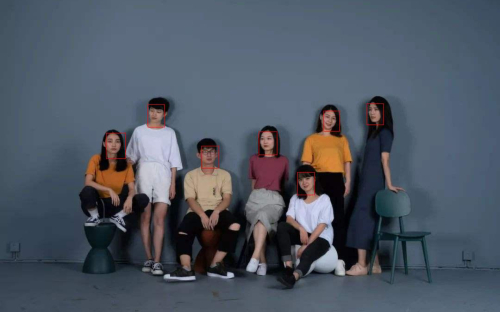
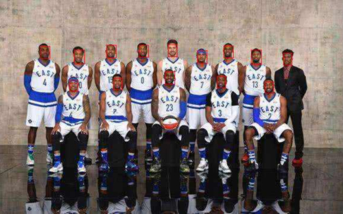

# one_project_of_mtcnn
mtcnn侦测网络对小目标的精准检测是有目共睹，并且在速度上也可以说是符合了商业
化的运用。学完mtcnn的原理之后，于是心血来潮，便自己实现了一个。有关于重点代码
的标注解释，在代码里均有详细的介绍，这样做的目的是为了方便阅读学习，今后修改起
代码也有所依据。如果对你们有所帮助的话，麻烦点个星，谢谢~ 后续会有陆续更新，包
括这篇说明文档~

# 关键技术点
   * FCN
   在P网络采用全卷积(FCN)的设计是因为，P网络接收的是不固定大小的数据；此处的每个像素点，
   都代表一个类别的预测，同时保留了原图像的空间信息。 
   * IOU
   IOU分两种：一种是以两者的交集为分母；一种是以两者间较小面积的框值为分母
   * MNS
   非极大值抑制，抑制不是极大值的元素。可以使用该方法去掉重合度较高且IOU值较小的框
   * Bounding - Box - regression
   * PReLu
   * Soft - NMS 
# 运行环境准备：
   * win10 + pytorch1.4.0 + Anaconda3(python3.7) + CUDA10.2 + CUDNN7.0

   * 关于配置，可以参考以下两篇博客，两位博主写得很详细：
     * https://blog.csdn.net/weixin_42158966/article/details/88543668
     * https://blog.csdn.net/qq_37296487/article/details/83028394

# 测试结果:

# 如何使用:

  * run > python detect.py

# 使用的数据集:

  * CelebA数据集：http://mmlab.ie.cuhk.edu.hk/projects/CelebA.html 可以选择官网提供的百度云盘进行下载
  * 下载后在img文件夹解压img_align_celeba_png.7z即可
  * 对应的人脸标签在Anno文件夹下
  * run > python sampling.py 处理好训练需要的数据

# 训练:

  * 准备好p网络需要的数据（12 * 12 的图片）
    * run > python train_pnet.py
    * run > python train_rnet.py
    * run > python train_onet.py

# 关于依赖库的导入：
    
    * run > pip install -r requirements.txt
